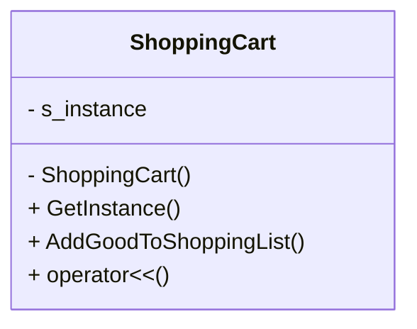

# 1. 小明的购物车【单例模式】
## 题目描述
小明去了一家大型商场，拿到了一个购物车，并开始购物。请你设计一个购物车管理器，记录商品添加到购物车的信息（商品名称和购买数量），并在购买结束后打印出商品清单。（在整个购物过程中，小明只有一个购物车实例存在）。

## 输入描述
输入包含若干行，每行包含两部分信息，分别是商品名称和购买数量。商品名称和购买数量之间用空格隔开。

## 输出描述
输出包含小明购物车中的所有商品及其购买数量。每行输出一种商品的信息，格式为 "商品名称 购买数量"。

## 输入示例
Apple 3
Banana 2
Orange 5

## 输出示例
Apple 3
Banana 2
Orange 5

## 提示信息
本道题目请使用单例设计模式： 
使用私有静态变量来保存购物车实例。
使用私有构造函数防止外部直接实例化。

# 2. 设计UML图参考

# 3. 代码实现说明

+ `singleton_hungry_ptr`: 单例模式饿汉式实现：一开始就分配资源，静态变量使用指针，多线程安全
+ `singleton_hungry_noPtr`: 单例模式饿汉式实现：一开始就分配资源，静态变量不使用指针，多线程安全
+ `singleton_lazy_unsafe`: 单例模式懒汉式实现：没有考虑多线程，不安全
+ `singleton_lazy_safe_doubleCheck`: 单例模式懒汉式实现：双重锁检查，多线程安全
+ `singleton_lazy_safe_funcStaticVariablePtr`: 单例模式懒汉式实现：在函数内使用静态变量，最终返回指针
+ `singleton_lazy_safe_funcStaticVariableRef`: 单例模式懒汉式实现：在函数内使用静态变量，最终返回引用
