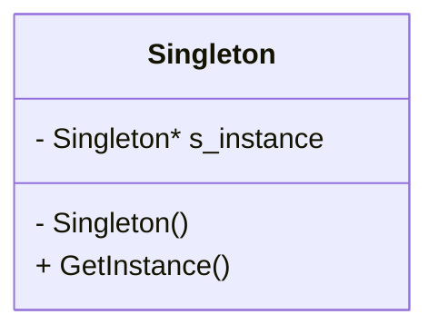

# 1. 单例模式

## 1.1 概述

想象你是一个学校的校长。学校里有很多东西只能有一个（比如：校长办公室、足球场、图书馆），如果有多个反而会出问题！

单例模式就是让一个类（比如 “校长办公室” 类）只能创建一个对象，而且全校师生都可以直接访问这个唯一的对象，不用再自己新建。

为什么需要单例模式呢？想象一下假如学校有多个 “校长办公室”，可能会出现：

+ 学生 A 找校长，去了办公室 1，发现没人。
+ 学生 B 找校长，去了办公室 2，发现校长在睡觉。
+ 混乱！不知道该去哪个办公室找校长！

单例模式具有以下好处：
+ 节省资源：只创建一个校长办公室，不用浪费材料建多个。
+ 避免冲突：所有人都知道校长只在一个办公室，不会迷路。

但它也具有缺点：

+ 不能继承：如果学校想新建一个 “副校长办公室”，想继承 “校长办公室” 的功能，但单例模式不允许这样做，因为它没有接口（就像校长办公室是独一无二的，不能复制）。这是因为单例类的构造函数是私有的，子类无法继承和创建自己的实例。
+ 违背单一职责原则：校长办公室应该只负责 “接见学生”，但单例模式让它还负责 “控制自己的数量”（只能有一个），相当于让校长同时管教学和盖房子，职责太多了！单例类既要实现自身的业务逻辑（如 `MeetWithStudent()`），又要控制实例化方式（`GetInstance`），违反了 “一个类只做一件事” 的原则。

单例模式其实相当于一个全局变量，且只有一个实例。在实现时单例模式实现的重点在于静态变量（一般命名为`s_instance`，类型为单例类的指针），静态变量相当于所有类共享一个变量，这个变量设置为`private`属性，为了防止用户建立多个实例破坏单例的初衷，将单例类的构造函数和析构函数都设置为`private`类型。然后提供一个静态函数（一般命名为`GetInstance`）来获取单例。



一般的单例模式的代码形式是：

```cpp
class Singleton
{
public:
    static Singleton* GetInstance()
    {
        /* code: get instance */
    }
private:
    Singleton() {}
    ~Singleton() {}
    static Singleton* s_instance;
};
/* code: init static variable: instance */
```

## 1.2 实现

下面来看看单例模式的不同的实现方式。

### 1.2.1 饿汉式实现

饿汉式指在程序启动时就完成初始化，这需要一开始就分配一段内存来进行初始化。虽然可能初始化会带来一定的性能问题，但是多线程访问是安全的。核心代码的实现：

```cpp
class Singleton
{
public:
    static Singleton* GetInstance()
    {
        /* code: get instance */
        if (s_instance == nullptr)
        {
            s_instance = new Singleton();
        }
        return s_instance;
    }
private:
    Singleton() {}
    ~Singleton() {}
    static Singleton* s_instance;
};
Singleton* Singleton::s_instance = nullptr;
```

上面的实现中，instance是一个Singleton*类型，我们也可以让instance是一个Singleton类型：

```cpp
class Singleton
{
public:
    static Singleton* GetInstance()
    {
        /* code: get instance */
        return &s_instance;
    }
private:
    Singleton() {}
    ~Singleton() {}
    static Singleton s_instance;
};
Singleton* Singleton::s_instance;
```


### 1.2.2 懒汉式实现（非线程安全版）

懒汉式指在第一次获取实例时才进行初始化，也就是需要时才加载，这样可以提高性能。核心代码的实现：

```cpp
class Singleton
{
public:
    static Singleton* GetInstance()
    {
        /* code: get instance */
        if (s_instance == nullptr)
        {
            s_instance = new Singleton();
        }
        return s_instance;
    }
private:
    Singleton() {}
    ~Singleton() {}
    static Singleton* s_instance;
};
Singleton* Singleton::s_instance = nullptr;
```

懒汉式的实现是在需要的时候才初始化的，如果在多线程环境下可能会产生多个实例，这是有风险的。

### 1.2.3 懒汉式实现（线程安全版）

我们可以使用互斥锁双重检查来尝试解决上面的线程安全的问题。下面是使用lock_guard双重检查的代码：


```cpp
class Singleton
{
public:
    static Singleton* GetInstance()
    {
        /* code: get instance */
        if (s_instance == nullptr)
        {
            std::lock_guard<std::mutex> lock(s_mutex);
            if (s_instance == nullptr)
            {
                s_instance = new Singleton();
            }
        }
        return s_instance;
    }
private:
    Singleton() {}
    ~Singleton() {}
    static Singleton* s_instance;
    static mutex s_mutex;
};
Singleton* Singleton::s_instance = nullptr;
mutex Singleton::s_mutex;
```

我们也可以在静态函数里定义静态变量s_instance，C++保证了函数内的静态变量是线程安全的，所以我们可以直接在静态函数里返回s_instance：

```cpp
class Singleton
{
public:
    static Singleton* GetInstance()
    {
        static s_instance;
        return &s_instance;
    }
private:
    Singleton() {}
    ~Singleton() {}
};
```

上面返回的是s_instance的指针，我们也可以向外面返回引用：

```cpp
class Singleton
{
public:
    static Singleton& GetInstance()
    {
        static s_instance;
        return s_instance;
    }
private:
    Singleton() {}
    ~Singleton() {}
};
```


