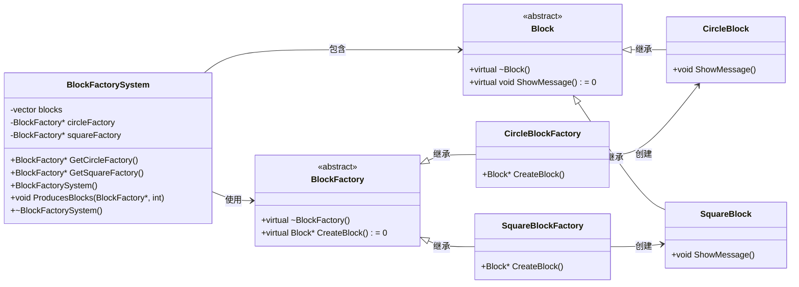

# 1. 积木工厂【工厂方法模式】
## 题目描述
小明家有两个工厂，一个用于生产圆形积木，一个用于生产方形积木，请你帮他设计一个积木工厂系统，记录积木生产的信息。

## 输入描述
输入的第一行是一个整数 N（1 ≤ N ≤ 100），表示生产的次数。 

接下来的 N 行，每行输入一个字符串和一个整数，字符串表示积木的类型。积木类型分为 "Circle" 和 "Square" 两种。整数表示该积木生产的数量

## 输出描述
对于每个积木，输出一行字符串表示该积木的信息。

## 输入示例
3
Circle 1
Square 2
Circle 1

## 输出示例
Circle Block
Square Block
Square Block
Circle Block

## 提示信息
在示例中，积木工厂生产了4块积木，其中有2块是圆形积木，2块是方形积木。根据输入的类型，每块积木的信息被输出到控制台。

# 2. 设计UML图参考

# 3. 代码实现说明
+ `factory`: 工厂模式实现。