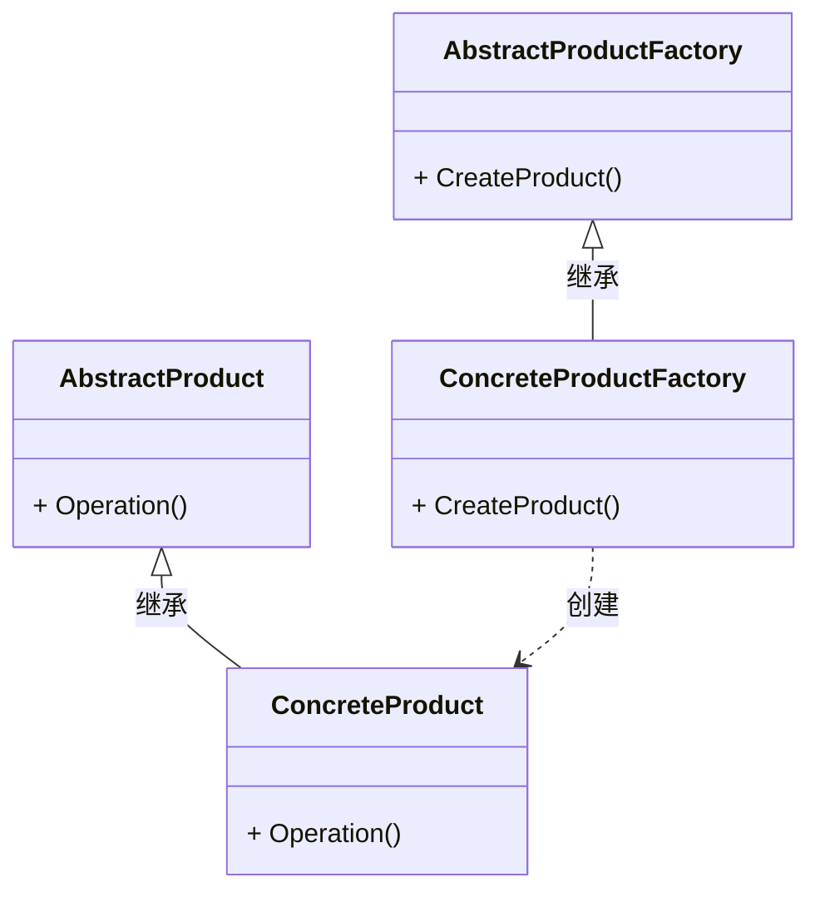

# 1. 工厂方法模式

## 1.1 概述

想象你是一家玩具工厂的老板。有一天，你的朋友小明想要一个机器人玩具，小红想要一个小熊玩具。你可以直接给他们做玩具，但这样太麻烦了！于是你决定：让工厂专门生产玩具，别人想要什么就直接找工厂拿！

这就是工厂方法模式的核心：把创建对象的过程封装在一个 “工厂” 里，让别人不用关心具体怎么做，直接拿成品就行！

又比如你要做一个游戏，里面有很多种敌人（外星人、僵尸、机器人）。如果每次需要敌人时都直接写代码创建，会很麻烦！而且如果以后要新增一种敌人（比如 “恐龙”），你就得改很多地方的代码。

工厂方法模式官方的说法是：它定义了一个创建对象的接口，但由子类决定实例化哪个类，工厂方法将对象的创建延迟到子类。它具有的优点包括：

+ **扩展性高**，如果需要增加新产品，只需扩展一个具体工厂类和具体产品即可。
+ **屏蔽了产品的具体实现**，调用者只关心产品的接口，直接调用工厂的统一接口即可制造产品。

同时也具有缺点：
+ **系统的复杂度增加**：每次增加一个产品时，都需要增加一个具体类和对应的工厂，使系统中类的数量成倍增加，增加了系统的复杂度和具体类的依赖。

实现上主要包括以下方面的内容：
+ 抽象产品（Abstract Product）：定义了产品的共同接口或抽象类。它可以是具体产品类的父类或接口，规定了产品对象的共同方法。
+ 具体产品（Concrete Product）：实现了抽象产品接口，定义了具体产品的特定行为和属性。
+ 抽象工厂（Abstract Factory）：声明了创建产品的抽象方法，可以是接口或抽象类。它可以有多个方法用于创建不同类型的产品。
+ 具体工厂（Concrete Factory）：实现了抽象工厂接口，负责实际创建具体产品的对象。

其类图可以表示为：



## 1.2 代码实现

根据上面的UML图可以很清晰地写出相应的代码，首先创建产品的抽象类：


```cpp
class Product {
public:
    virtual void Operation() = 0;
};
```

然后创建具体产品类，这里加入有两种不同的产品：`ConcreteProductA`和`ConcreteProductB`：


```cpp
class ConcreteProductA : public Product {
public:
    void Operation() override {
        std::cout << "ConcreteProductA" << std::endl;
    }
};

class ConcreteProductB : public Product {
public:
    void Operation() override {
        std::cout << "ConcreteProductB" << std::endl;
    }
};
```

然后我们创建工厂的抽象类：

```cpp
class ProductFactory {
public:
    virtual Product* CreateProduct() = 0;
};
```

接着我们创建具体的工厂类：

```cpp
class ConcreteProductFactoryA : public ProductFactory {
public:
    Product* CreateProduct() override {
        return new ConcreteProductA();
    }
};

class ConcreteProductFactoryB : public ProductFactory {
public:
    Product* CreateProduct() override {
        return new ConcreteProductB();
    }
};
```

我们使用上面的工厂类来创建产品：

```cpp
int main() {
    ProductFactory* factoryA = new ConcreteProductFactoryA();
    Product* productA = factoryA->CreateProduct();
    productA->Operation();

    ProductFactory* factoryB = new ConcreteProductFactoryB();
    Product* productB = factoryB->CreateProduct();
    productB->Operation();

    delete productA;
    delete productB;
    delete factoryA;
    delete factoryB;

    return 0;
}
```

如果我们需要新增一种产品，只需要新增一个具体产品类和对应的工厂类，而不需要修改原有的代码。


