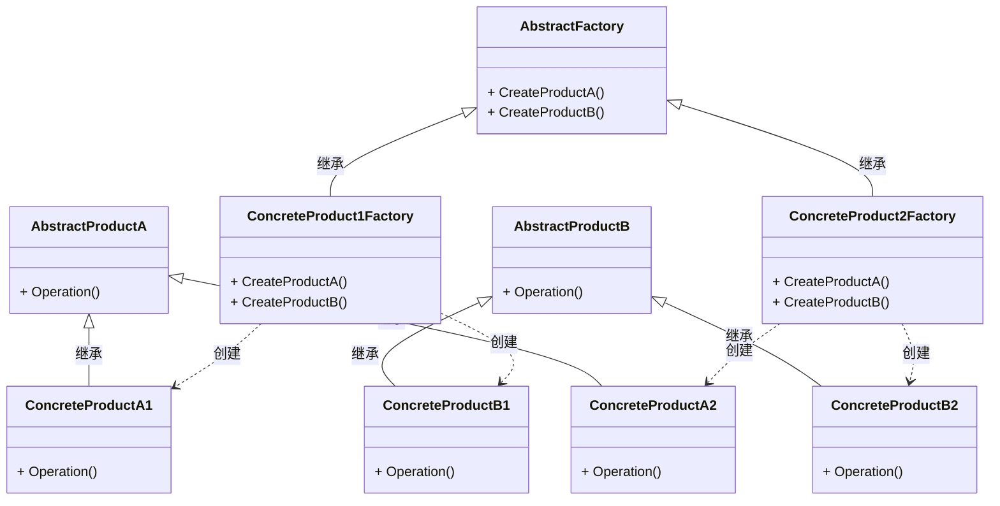

# 1. 抽象工厂方法模式

## 1.1 概述

想想生活里的事儿，比如手机生产。有 “手机零件工厂” 这超级工厂，它能造出屏幕、电池、摄像头这些零件，这些零件得搭配着用，它们就像 “手机零件产品族” ，得一起工作才对。要是屏幕是苹果手机的，电池却是安卓手机的，装一起手机就坏啦。

简单说就是：抽象工厂模式就是有个超级工厂，它定好规则，能造出不同的小工厂；这些小工厂，又能造出 “配套” 的产品。

它具有的优点包括：
+ 确保同一产品族的对象一起工作：以手机为例子，抽象工厂模式的超级工厂，能保证小工厂造出的屏幕、电池、摄像头，肯定是能配套用的。不会有苹果工厂的屏幕和安卓手机的电池混用的情况。
+ 客户端不用知道具体类，简化代码：使用手机时，不关系手机的屏幕、电池、摄像头是怎么制造的，手机能正常用就行。调用相应的接口就可以得到配套的产品，代码变得清爽。

当然它也具有缺点：
+ 扩展产品族非常难：增加一个新的产品族需要修改抽象工厂和所有具体工厂的代码。要是给手机加个 “5G 信号模块” 新零件，让手机变成 “新手机产品族” ，那超级工厂得改规则，所有小工厂（造屏幕、电池这些的）也得跟着改代码，才能造出带 5G 模块的配套零件。


抽象工厂模式包含以下几个主要角色：

+ 抽象工厂（Abstract Factory）：声明了一组用于创建产品对象的方法，每个方法对应一种产品类型。抽象工厂可以是接口或抽象类。
+ 具体工厂（Concrete Factory）：实现了抽象工厂接口，负责创建具体产品对象的实例。
+ 抽象产品（Abstract Product）：定义了一组产品对象的共同接口或抽象类，描述了产品对象的公共方法。
+ 具体产品（Concrete Product）：实现了抽象产品接口，定义了具体产品的特定行为和属性。

抽象工厂模式通常涉及一族相关的产品，每个具体工厂类负责创建该族中的具体产品。客户端通过使用抽象工厂接口来创建产品对象，而不需要直接使用具体产品的实现类。

其类图可以表示为：




解释一下这个图：
1. `AbstractFactory`抽象工厂类提供通用接口，包括创建产品A和产品B的方法：`CreateProductA`和`CreateProductB`。
2. 由抽象工厂类`AbstractFactory`得到两个具体的工厂，分别生产1号产品和2号产品，分别是`ConcreteProduct1Factory`和`ConcreteProduct2Factory`，它们实现了`AbstractFactory`接口，负责创建产品A和产品B，分别是`AbstractProductA`和`AbstractProductB`，这也是抽象类，产品A1和产品A2是产品A的具体实现类（`ConcreteProductA1`和`ConcreteProductA2`），产品B1和产品B2是产品B的具体实现类（`ConcreteProductB1`和`ConcreteProductB2`）。
3. `ConcreteProduct1Factory`生产1号产品，在这里具体包括`ConcreteProductA1`和`ConcreteProductB1`，`ConcreteProduct2Factory`生产2号产品，在这里具体包括`ConcreteProductA2`和`ConcreteProductB2`。

## 1.2 代码实现

根据上面的UML图可以很清晰地写出相应的代码，首先创建超级工厂的抽象类：

```cpp
class AbstractFactory {
public:
    virtual AbstractProductA* CreateProductA() = 0;
    virtual AbstractProductB* CreateProductB() = 0;
};
```

然后创建具体的工厂类：

```cpp
class ConcreteProduct1Factory : public AbstractFactory {
public:
    AbstractProductA* CreateProductA() override {
        return new ConcreteProductA1();
    }

    AbstractProductB* CreateProductB() override {
        return new ConcreteProductB1();
    }
};

class ConcreteProduct2Factory : public AbstractFactory {
public:
    AbstractProductA* CreateProductA() override {
        return new ConcreteProductA2();
    }

    AbstractProductB* CreateProductB() override {
        return new ConcreteProductB2();
    }
};
```

然后创建产品的抽象类：

```cpp
class AbstractProductA {
public:
    virtual void Operation() = 0;
};

class AbstractProductB {
public:
    virtual void Operation() = 0;
};
```

最后创建产品的具体类：

```cpp
class ConcreteProductA1 : public AbstractProductA {
public:
    void Operation() override {
        std::cout << "ConcreteProductA1" << std::endl;
    }
};

class ConcreteProductA2 : public AbstractProductA {
public:
    void Operation() override {
        std::cout << "ConcreteProductA2" << std::endl;
    }
};


class ConcreteProductB1 : public AbstractProductB {
public:
    void Operation() override {
        std::cout << "ConcreteProductB1" << std::endl;
    }
};  

class ConcreteProductB2 : public AbstractProductB {
public:
    void Operation() override {
        std::cout << "ConcreteProductB2" << std::endl;
    }
};
```


