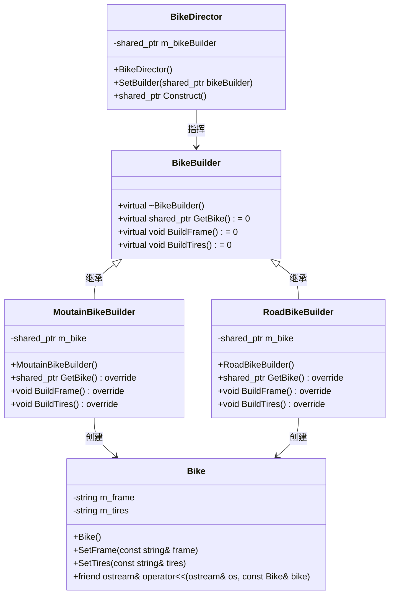

# 1. 自行车加工（建造者模式）

## 题目描述

小明家新开了一家自行车工厂，用于使用自行车配件（车架 frame 和车轮 tires ）进行组装定制不同的自行车，包括山地车和公路车。

山地车使用的是Aluminum Frame（铝制车架）和 Knobby Tires（可抓地轮胎），公路车使用的是 Carbon Frame （碳车架）和 Slim Tries。

现在它收到了一笔订单，要求定制一批自行车，请你使用【建造者模式】告诉小明这笔订单需要使用那些自行车配置吧。

## 输入描述

输入的第一行是一个整数 N（1 ≤ N ≤ 100），表示订单的数量。 

接下来的 N 行，每行输入一个字符串，字符串表示客户的自行车需求。

字符串可以包含关键词 "mountain" 或 "road"，表示客户需要山地自行车或公路自行车。

## 输出描述

对于每笔订单，输出该订单定制的自行车配置。

## 输入示例

3

mountain
road
mountain

## 输出示例

Aluminum Frame Knobby Tires
Carbon Frame Slim Tires
Aluminum Frame Knobby Tires

# 提示信息
在本例中：产品为自行车，可以有两个建造者：山地车建造者和公路车建造者。

# 2. 设计UML图参考

# 3. 代码实现说明
+ `builder.cpp`: 建造者式实现。
