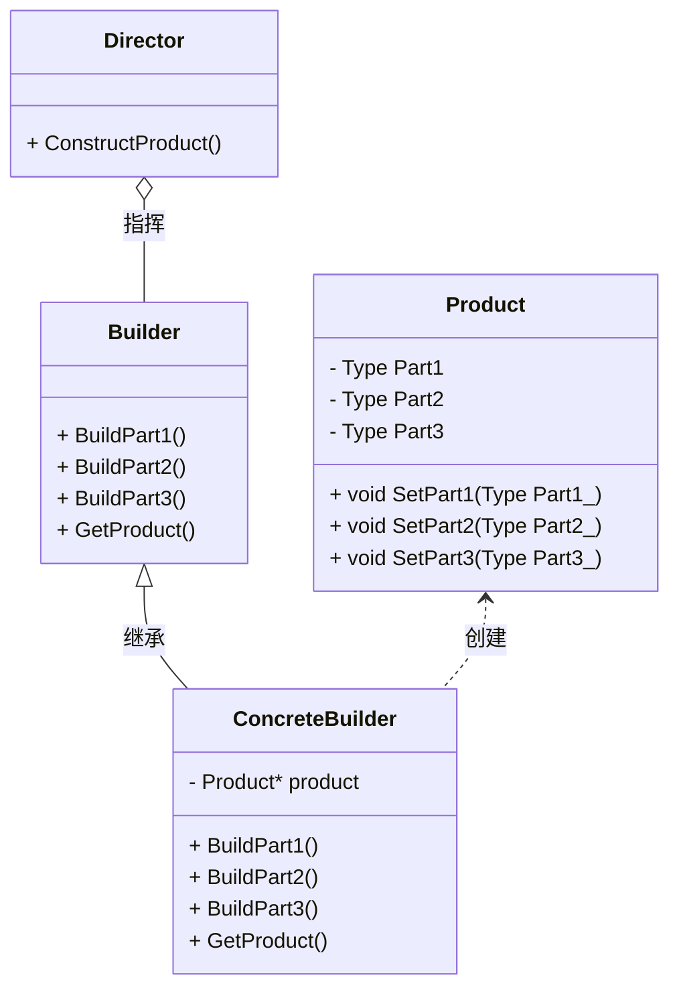

# 1. 建造者模式

## 1.1 概述

建造者模式就像搭乐高积木 —— 比如你想拼一个 “城堡”（这是复杂对象），积木的搭建步骤（构建过程）和最后拼出来的城堡样子（表示）是分开的。我们可以用同一套积木，按不同步骤拼出 “带塔楼的城堡”“带护城河的城堡”，这就是 “用相同构建过程做出不同表示”。

建造者模式具有以下**优点**：

+ **灵活调整，做出不同样子**：好比如做蛋糕：基础步骤都是 “打鸡蛋→拌面粉→烤蛋糕→加装饰”（构建过程），但装饰时可以加水果、巧克力、奶油，做出不同样子的蛋糕（不同表示）不用改步骤，就能换样子，这就是灵活。
+ **控制细节，不用操心过程**：你去蛋糕店说 “要个水果蛋糕”，店员（指导者）会让师傅（建造者）按步骤做，你不用知道 “鸡蛋要打几分钟”“烤箱温度多少”—— 细节被隐藏了。
+ **步骤能重复用**：比如搭乐高的 “拼墙壁” 步骤，不管拼城堡还是房子，都能重复用这个步骤，不用每次重新想怎么拼。

但是建造者模式也有**缺点**：

+ **东西太简单就没必要**：如果只是做个 “馒头”（只有面粉 + 水，没复杂步骤），用建造者模式就像 “用乐高拼一块积木”—— 太麻烦，反而让步骤变多（代码冗余）。
+ **类和对象变多**：做蛋糕需要 “蛋糕师（具体建造者）”“蛋糕店老板（指导者）”“蛋糕（产品）”“做蛋糕的说明书（抽象建造者）”—— 比直接自己做蛋糕多了好几个角色，就像本来自己煮泡面，现在非要请个厨师、一个服务员，反而复杂了。

建造者模式主要用于对象内部结构复杂、属性之间有依赖（顺序要求）的场景下。

建造者模式和工厂模式是有区别的，用做饭举例：

+ 工厂模式：你说 “要一份炒饭”，厨房直接给你做好的 —— 关注 “做出什么”。
+ 建造者模式：你说 “要一份炒饭，先放鸡蛋，再放火腿，最后少放盐”—— 关注 “怎么做（步骤顺序）”。

建造者模式主要有以下**区别**：

+ 产品（Product）：最终拼好的高达模型（复杂对象）。
+ 抽象建造者（Builder）：拼高达的说明书，写着 “必须拼头部、身体、武器”（规定要做哪些步骤）。
+ 具体建造者（Concrete Builder）：按说明书拼模型的你，具体决定 “头部用红色零件，武器用剑还是枪”。
+ 指导者（Director）：模型店老板，和建造者关联，他会提醒建造者 “先拼身体再拼手臂，不然装不上”（控制步骤顺序）。

其类图可以表示为：



解释一下这个图：
1. `Director`知道建造的顺序，它需要知道使用哪个Builder来建造，并且调用`Builder`提供的建造接口来完成产品的建造。
2. `Builder`是一个抽象类，提供建造一个产品的所有的零部件的接口，如这里的`BuildPart1`、`BuildPart2`、`BuildPart3`，另外还提供`GetProduct`接口来返回建造好的产品。
3. `ConcreteBuilder`是`Builder`的具体实现类，实现`BuildPart1`、`BuildPart2`、`BuildPart3`的接口，并且包含产品的实例，这些接口会调用产品的方法来完成产品的建造：`SetPart1`、`SetPart2`、`SetPart3`，注意`BuildPart`接口没有传参，隐藏了`SetPart`传参的细节。
4. `Product`是产品类，包含产品的所有零部件，如这里的`Part1`、`Part2`、`Part3`，这些零部件可以通过`ConcreteBuilder`来自定义。
5. 派生不同的`ConcreteBuilder`可以创建不同的产品，但产品的组成是一样的，比如一个高达总是有头部、身体、武器，但是头部、身体、武器的具体零件可以不同。


## 1.2 代码实现


先定义产品类`Product`，包含产品的所有零部件，如这里的`Part1`、`Part2`、`Part3`，这些零部件可以通过`ConcreteBuilder`来自定义。这里使用智能指针防止内存泄漏和重复释放。

 ```cpp
class Product {
private:
    string m_part1;
    string m_part2;
    string m_part3;
public:
    Product() = default;
    void SetPart1(const std::string& part1) {
        m_part1 = part1_;
    }

    void SetPart2(const std::string& part2) {
        m_part2 = part2_;
    }

    void SetPart3(const std::string& part3) {
        m_part3 = part3_;
    }
    void showInfo() const
    {
        cout << "part1: " << m_part1 << endl;
        cout << "part2: " << m_part2 << endl;
        cout << "part3: " << m_part3 << endl;
    }
};
```

然后定义Builder抽象类：

 ```cpp
class Builder {
public:
    virtual ~Builder() = default;
    virtual void BuildPart1() = 0;
    virtual void BuildPart2() = 0;
    virtual void BuildPart3() = 0;
    virtual shared_ptr<Product> GetProduct() = 0;
};
```

接着定义Builder的具体类：

 ```cpp
class ConcreteBuilder : public Builder {
public:
    ConcreteBuilder()
    {
        m_product = make_shared<Product>();

    }
    virtual void BuildPart1() override {
        m_product->SetPart1("part1");
    }

    virtual void BuildPart2() override {
        m_product->SetPart2("part2");
    }

    virtual void BuildPart3() override {
        m_product->SetPart3("part3");
    }

    virtual shared_ptr<Product> GetProduct() override {
        return m_product;
    }
private:
    shared_ptr<Product> m_product;
};
```

最后我们定义指导者类`Director`：

 ```cpp
class Director {
public:
    Director() = default;
    void SetBuilder(shared_ptr<Builder> builder)
    {
        m_builder = make_shared<Builder>(builder);
    }
    void ConstructProduct()
    {
        m_builder->BuildPart1();
        m_builder->BuildPart2();
        m_builder->BuildPart3();
    }
private:
    shared_ptr<Builder> m_builder;
};
```

最后我们可以使用建造者模式来创建产品：

 ```cpp
int main() {
    Director director;
    auto builder = make_shared<ConcreteBuilder>();
    director.SetBuilder(builder);
    director.ConstructProduct();
    auto product = builder->GetProduct();
    product->ShowInfo();
    return 0;
}
```


 