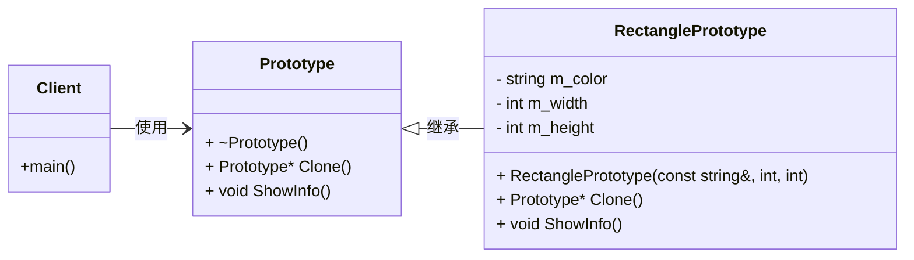

# 1.矩形原型（原型模式）

# 题目描述

公司正在开发一个图形设计软件，其中有一个常用的图形元素是矩形。设计师在工作时可能需要频繁地创建相似的矩形，而这些矩形的基本属性是相同的（颜色、宽度、高度），为了提高设计师的工作效率，请你使用原型模式设计一个矩形对象的原型。使用该原型可以快速克隆生成新的矩形对象。

# 输入描述
首先输入一个字符串，表示矩形的基本属性信息，包括颜色、长度和宽度，用空格分隔，例如 "Red 10 5"。

然后输入一个整数 N（1 ≤ N ≤ 100），表示使用原型创建的矩形数量。

# 输出描述

对于每个矩形，输出一行字符串表示矩形的详细信息，如 "Color: Red, Width: 10,Height: 5"。

# 输入示例

Red 10 5
3

# 输出示例

Color: Red, Width: 10, Height: 5
Color: Red, Width: 10, Height: 5
Color: Red, Width: 10, Height: 5

# 提示信息

使用原型模式中的克隆方法实现矩形对象的创建。

# 2. 设计UML图参考

# 3. 代码实现说明
+ `prototype.cpp`: 原型模式实现。

