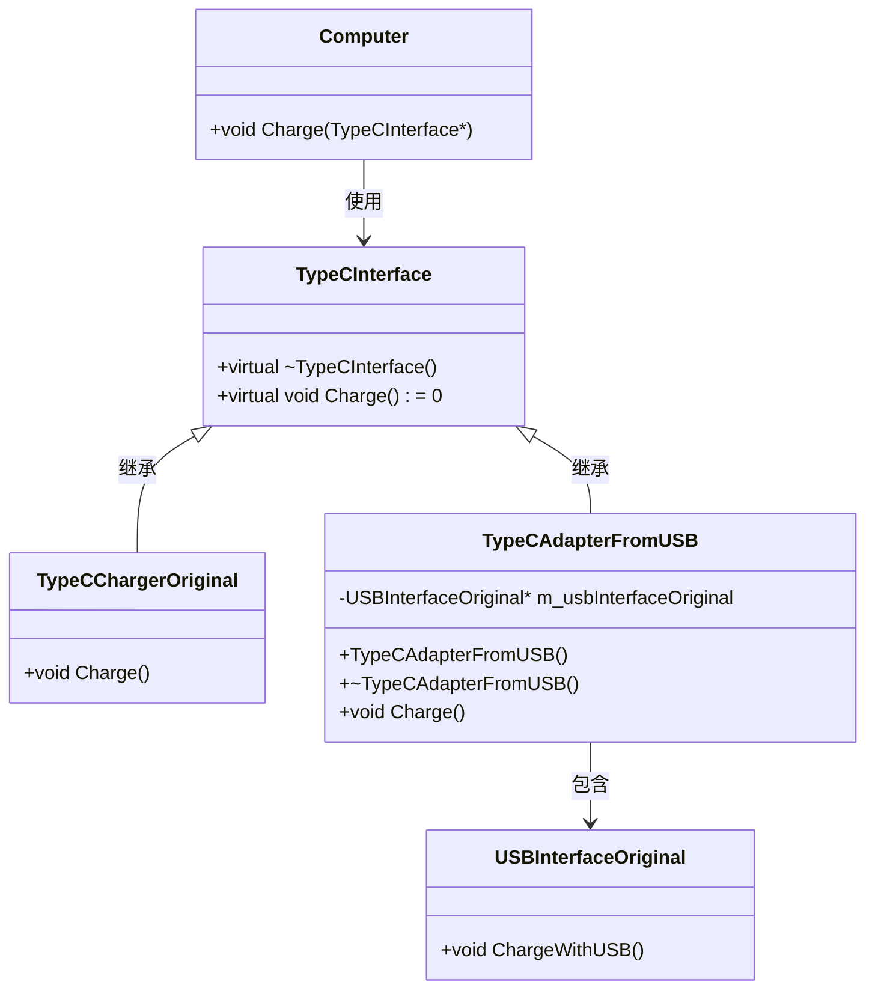

# 1. 扩展坞（适配器模式）

## 题目描述
小明购买了一台新电脑，该电脑使用 TypeC 接口，他已经有了一个USB接口的充电器和数据线，为了确保新电脑可以使用现有的USB接口充电器和数据线，他购买了一个TypeC到USB的扩展坞。

请你使用适配器模式设计并实现这个扩展坞系统，确保小明的新电脑既可以通过扩展坞使用现有的USB接口充电线和数据线，也可以使用TypeC接口充电。

## 输入描述
题目包含多行输入，第一行输入一个数字 N （1 < N <= 20)，表示后面有N组测试数据。

之后N行都是一个整数，1表示使用电脑本身的TypeC接口，2表示使用扩展坞的USB接口充电。

## 输出描述

根据每行输入，输出相应的充电信息。

## 输入示例
3
1
2
1

## 输出示例
TypeC
USB Adapter
TypeC

# 2. 设计UML图参考

# 3. 代码实现说明
+ `adapter.cpp`: 适配器模式实现。   