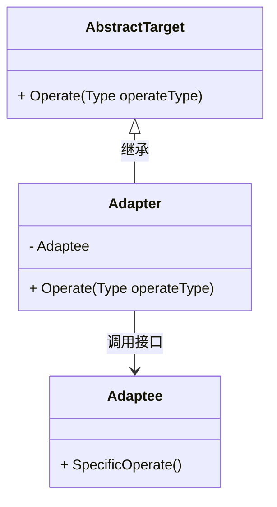

# 1. 原型模式

## 1.1 概述

想象一个场景：你去国外旅游，带了中国的手机充电器（插头是两脚扁形），但国外的插座是三脚圆形的 —— 直接插用不了。这时候你需要一个 “插头转换器”：一头接中国充电器，一头接国外插座，让两者能一起工作。

适配器模式里的 “适配器”，就相当于这个插头转换器 ——当两个东西接口不兼容（比如一个类的方法和系统需要的方法不一样），用一个中间 “适配器” 连接它们，让它们能协同工作。

编程里推荐 “让适配器依赖原类”，而不是 “适配器继承原类”。以插头为例：

+ **继承方式**：相当于把 “中国插头” 和 “转换器” 焊死在一起 —— 如果换了国外插座类型，就得重新焊一个新的，不灵活。
+ **依赖方式**：相当于把转换器做成独立的插头 —— 插头和转换器是分开的，换插座时只换转换器就行，灵活多了。

适配器模式具有以下优点：

+ **让不兼容的东西一起工作**：就像插头转换器让中国充电器在国外能用，解决 “旧东西用在新场景” 的问题。
+ **旧东西能复用**：不用因为接口不对就扔掉旧音箱，节省成本（对应编程里 “复用现有类，不用重写代码”）。
+ **不用改原东西**：适配器是中间件，原音箱和新手机都不用改造，只加一个转换器就行（对应编程里 “不修改原有类，安全”）。

但是适配器也有缺点：

+ **系统变复杂，不好维护**。试想如果家里到处都是适配器 —— 手机一个、电脑一个、相机一个，找起来很麻烦，还容易插错。

原型式主要有以下**主要角色**：

+ **目标接口**：定义客户所需的接口，适配器需要实现这个接口。
+ **源接口**：需要适配的接口，适配器需要适配这个接口。
+ **适配器类**：实现目标接口，适配器类需要持有源接口的实例，通过调用源接口的方法来实现目标接口的方法。

其类图可以表示为：




解释一下这个图：
1. `AbstractTarget`是抽象的目标接口类，`Adapter`是它的具体实现，继承了它的`Operate`接口。`Adapter`又包含了`Adaptee`对象，从而实现适配可以在目标接口`Operate`中调用源接口的方法`SpecificOperate`（`Adaptee`提供）。


## 1.2 代码实现

源接口类为`Adaptee`类：

```cpp
class Adaptee {
public:
    void SpecificOperate()
    {
        std::cout << "Adaptee SpecificOperate" << std::endl;
    }
};
```

然后构造`AbstractTarget`类：
```cpp
class AbstractTarget {
public:
    virtual void Operate(Type operateType) = 0;
};
```

从`AbstractTarget`抽象类得到具体的`Adapter`类、`Adaptee`类：


```cpp
class Adaptee {
public:
    void SpecificOperate() {
        std::cout << "Adaptee SpecificOperate" << std::endl;
    }
};

class Adapter : public AbstractTarget {
    Adaptee m_adaptee;
public:
    Adapter() {
        m_adaptee = new Adaptee();
    }
    ~Adapter() {
        delete m_adaptee;
    }
    void Operate(Type operateType) override {
        m_adaptee->SpecificOperate();
    }
};
```